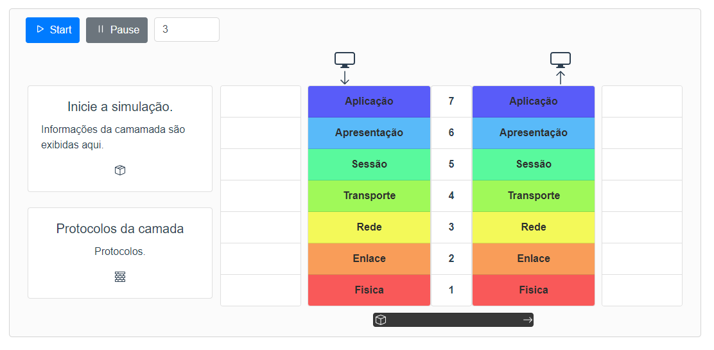

# Protótipo OSI
  
Prototipo de módulo sobre o modelo OSI para auxiliar em aulas. Estágio 2020/2 - CEULP/ULBRA.
### 🔧 Instalação
```
git clone https://github.com/jonhtan/prototipo-osi.git
cd prototipo-osi
npm install
```
💻 Ambiente de desenvolvimento:
```
npm run serve
```
🚀 Gerar build de produção:
```
npm run build
```

### ▶️ Live Demo
> https://prototipo-osi.netlify.app/

